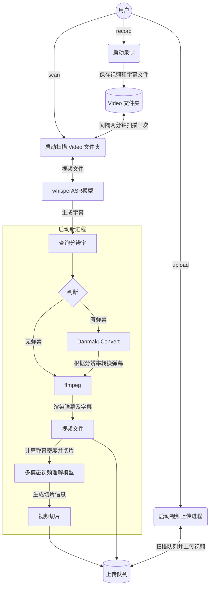

<div align="center">
  <picture>
    <source media="(prefers-color-scheme: dark)" srcset="assets/headerDark.svg" />
    
  </picture>

*7 x 24 小时无人监守录制、渲染弹幕、识别字幕、自动切片、自动上传、兼容超低配机器，启动项目，人人都是录播员。*

[:page_facing_up: Documentation](https://timerring.github.io/bilive/) |
[:gear: Installation](#quick-start) |
[:thinking: Reporting Issues](https://github.com/timerring/bilive/issues/new/choose)

支持模型

  
  
  
  
  
  
  
  
  
  
  
  
  
  
</div>

##  1. Introduction

> 如果您觉得项目不错，欢迎 :star: 也欢迎 PR 合作，如果有任何疑问，欢迎提 issue 交流。

自动监听并录制B站直播和弹幕（含付费留言、礼物等），根据分辨率转换弹幕、语音识别字幕并渲染进视频，根据弹幕密度切分精彩片段并通过视频理解大模型生成有趣的标题，自动投稿视频和切片至B站，兼容无GPU版本，兼容超低配置服务器与主机。

## 2. Major features

- **速度快**：采用 `pipeline` 流水线处理视频，理想情况下录播与直播相差半小时以内，没下播就能上线录播，**目前已知 b 站录播最快版本**！
- **多房间**：同时录制多个直播间内容视频以及弹幕文件（包含普通弹幕，付费弹幕以及礼物上舰等信息）。
- **占用小**：自动删除本地已上传的视频，极致节省空间。
- **模版化**：无需复杂配置，开箱即用，通过 b 站搜索建议接口自动抓取相关热门标签。
- **检测片段并合并**：对于网络问题或者直播连线导致的视频流分段，能够自动检测合并成为完整视频。
- **自动渲染弹幕**：自动转换xml为ass弹幕文件，该转换工具库已经开源 [DanmakuConvert](https://github.com/timerring/DanmakuConvert) 并且渲染到视频中形成**有弹幕版视频**并自动上传。
- **硬件要求极低**：无需GPU，只需最基础的单核CPU搭配最低的运存即可完成录制，弹幕渲染，上传等等全部过程，无最低配置要求，10年前的电脑或服务器依然可以使用！
- **( :tada: NEW)自动渲染字幕**：采用 OpenAI 的开源模型 `whisper`，自动识别视频内语音并转换为字幕渲染至视频中。
- **( :tada: NEW)自动切片上传**：根据弹幕密度计算寻找高能片段并切片，该自动切片工具库已开源 [auto-slice-video](https://github.com/timerring/auto-slice-video)，结合多模态视频理解大模型自动生成有意思的切片标题及内容，并且自动上传，目前已经支持的模型有：
  - `GLM-4V-PLUS`
  - `Gemini-2.0-flash`
  - `Qwen-2.5-72B-Instruct`
- **( :tada: NEW)持久化登录/下载/上传视频(支持多p投稿)**：[bilitool](https://github.com/timerring/bilitool) 已经开源，实现持久化登录，下载视频及弹幕(含多p)/上传视频(可分p投稿)，查询投稿状态，查询详细信息等功能，一键pip安装，可以使用命令行 cli 操作，也可以作为api调用。
- **( :tada: NEW)自动多平台循环直播推流**：该工具已经开源 [looplive](https://github.com/timerring/looplive) 是一个 7 x 24 小时全自动**循环多平台同时推流**直播工具。
- **( :tada: NEW)自动生成风格变换的视频封面**：采用图生图多模态模型，自动获取视频截图并上传风格变换后的视频封面。
  - `Minimax image-01`
  - `Kwai Kolors`
  - `Tencent Hunyuan`
  - `Baidu ERNIE irag-1.0`
  - `Stable Diffusion 3.5 large turbo`
  - `Luma Photon`
  - `Ideogram V_2`


项目架构流程如下：




## 3. 测试硬件
+ OS: Ubuntu 22.04.4 LTS
+ CPU：2核 Intel(R) Xeon(R) Platinum 85
+ GPU：无
+ 内存：2G
+ 硬盘：40G
+ 带宽: 3Mbps
+ Python 版本: 3.10
  > 个人经验：若想尽可能快地更新视频，主要取决于上传速度而非弹幕渲染速度，因此建议网络带宽越大越好。

## 4. Quick start

更详细的教程请参考文档 [bilive](https://timerring.github.io/bilive/)

> [!NOTE]
> 如果你是 windows 用户，请使用 WSL 运行本项目。

### Mode
首先介绍本项目三种不同的处理模式：(以下特指 asr_method="deploy" 的情况，如填"none"或者"api"则不涉及 GPU, 可以忽略对 GPU 的描述)
1. `pipeline` 模式(默认): 目前最快的模式，需要 GPU 支持，最好在 `blrec` 设置片段为半小时以内，asr 识别和渲染并行执行，分 p 上传视频片段。

2. `append` 模式: 基本同上，但 asr 识别与渲染过程串行执行，比 pipeline 慢预计 25% 左右，对 GPU 显存要求较低，兼顾硬件性能与处理上传效率。

3. `merge` 模式: 等待所有录制完成，再进行识别渲染合并过程，上传均为完整版录播（非分 P 投稿），等待时间较长，效率较慢，适合需要上传完整录播的场景。


> [!IMPORTANT]
> 凡是用到 GPU 均需保证 GPU 显存大于运行程序所需 VRAM，具体计算 VRAM 方法可以参考[该部分](https://timerring.github.io/bilive/models.html#计算-vram-需求)。

### Installation

> [!TIP]
> 如果你是 windows 用户，请使用 WSL 运行本项目。

#### 0. clone 项目

由于项目引入了我写的 submodule [DanmakuConvert](https://github.com/timerring/DanmakuConvert)，[bilitool](https://github.com/timerring/bilitool) 和 [auto-slice-video](https://github.com/timerring/auto-slice-video)，因此推荐 clone 项目时就更新 submodules。

```bash
git clone --recurse-submodules https://github.com/timerring/bilive.git
```

如果你没有采用上述方式 clone 项目，请更新 submodules：

```bash
git submodule update --init --recursive
```

#### 1. 安装依赖(推荐创建虚拟环境)

```
cd bilive
pip install -r requirements.txt
```

此外请根据各自的系统类型安装对应的 [`ffmpeg`](https://www.ffmpeg.org/download.html)，例如 [ubuntu 安装 ffmpeg](https://gcore.com/learning/how-to-install-ffmpeg-on-ubuntu/)。

[常见问题收集](https://timerring.github.io/bilive/install-questions.html)

#### 2. 设置环境变量用于保存项目根目录

```
./setPath.sh && source ~/.bashrc
```

#### 3. 配置 whisper 模型及 MLLM 模型

##### 3.1 whisper 语音识别

`ASR_METHOD` 默认为 none, 即不进行语音字幕识别。

##### 3.1.1 采用 api 方式

将 `bilive.toml` 文件中的 `ASR_METHOD` 参数设置为 `api`，然后填写 `WHISPER_API_KEY` 参数为你的 [API Key](https://console.groq.com/keys)。本项目采用 groq 提供 free tier 的 `whisper-large-v3-turbo` 模型，上传限制为 40 MB（约半小时），因此如需采用 api 识别的方式，请将视频录制分段调整为 30 分钟。此外，free tier 请求限制为 7200秒/20次/小时，28800秒/2000次/天。如果有更多需求，也欢迎升级到 dev tier，更多信息见[groq 官网](https://console.groq.com/docs/rate-limits)。

##### 3.1.2 采用本地部署方式(需保证有 NVIDIA 显卡)

将 `bilive.toml` 文件中的 `ASR_METHOD` 参数设置为 `deploy`，然后下载所需模型文件，并放置在 `src/subtitle/models` 文件夹中。

项目默认采用 [`small`](https://openaipublic.azureedge.net/main/whisper/models/9ecf779972d90ba49c06d968637d720dd632c55bbf19d441fb42bf17a411e794/small.pt) 模型，请点击下载所需文件，并放置在 `src/subtitle/models` 文件夹中。

> [!TIP]
> + 请保证 NVIDIA 显卡驱动安装正确 `nvidia-smi` `nvcc -V`，并能够调用 CUDA 核心 `print(torch.cuda.is_available())` 返回 `True`。如果未配置显卡驱动或未安装 `CUDA`，即使有 GPU 也无法使用，而会使用 CPU 推理，非常消耗 CPU 计算资源，不推荐，如果 CPU 硬件条件好可以尝试。
> + 使用该参数模型至少需要保证有显存大于 2.7GB 的 GPU，否则请使用其他参数量的模型。
> + 更多模型请参考 [whisper 参数模型](https://timerring.github.io/bilive/models.html) 部分。
> + 更换模型方法请参考 [更换模型方法](https://timerring.github.io/bilive/models.html#更换模型方法) 部分。

##### 3.2 MLLM 模型

MLLM 模型主要用于自动切片后的切片标题生成，此功能默认关闭，如果需要打开请将 `bilive.toml` 文件中的 `AUTO_SLICE` 参数设置为 `True`。其他配置分别有：
- `SLICE_DURATION` 以秒为单位设置切片时长（不建议超过 60 秒）。
- `SLICE_NUM` 设置切片数量。
- `SLICE_OVERLAP` 设置切片重叠时长。切片采用滑动窗口法处理，细节内容请见 [auto-slice-video](https://github.com/timerring/auto-slice-video)
- `SLICE_STEP` 设置切片步长。
- `MIN_VIDEO_SIZE` 设置切片最小视频大小。防止对一些连线或者网络波动原因造成的短片段再切片。

##### 3.2.1 GLM-4V-PLUS 模型

> 如需使用 GLM-4V-PLUS 模型，请将 `bilive.toml` 文件中的 `MLLM_MODEL` 参数设置为 `zhipu`

在项目的自动切片功能需要使用到智谱的 [`GLM-4V-PLUS`](https://bigmodel.cn/dev/api/normal-model/glm-4) 模型，请自行[注册账号](https://www.bigmodel.cn/invite?icode=shBtZUfNE6FfdMH1R6NybGczbXFgPRGIalpycrEwJ28%3D)并申请 API Key，填写到 `bilive.toml` 文件中对应的 `ZHIPU_API_KEY` 中。

##### 3.2.2 Gemini 模型

> 如需使用 Gemini-2.0-flash 模型，请将 `bilive.toml` 文件中的 `MLLM_MODEL` 参数设置为 `gemini`

在项目的自动切片功能需要使用到 Gemini-2.0-flash 模型，请自行[注册账号](https://aistudio.google.com/app/apikey)并申请 API Key，填写到 `bilive.toml` 文件中对应的 `GEMINI_API_KEY` 中。

##### 3.2.3 Qwen 模型

> 如需使用 Qwen-2.5-72B-Instruct 模型，请将 `bilive.toml` 文件中的 `MLLM_MODEL` 参数设置为 `qwen`

在项目的自动切片功能需要使用到 Qwen-2.5-72B-Instruct 模型，请自行[注册账号](https://bailian.console.aliyun.com/?apiKey=1)并申请 API Key，填写到 `bilive.toml` 文件中对应的 `QWEN_API_KEY` 中。

#### 3.3 Image Generation Model

采用图生图多模态模型，自动获取视频截图并上传风格变换后的视频封面，如需使用本功能，请将 `bilive.toml` 文件中 `generate_cover` 参数设置为 `true`。

##### 3.3.1 Minimax 模型

> 如需使用 Minimax 模型，请将 `IMAGE_GEN_MODEL` 参数设置为 `minimax`。

在项目的自动切片功能需要使用到 Minimax 模型，请自行[注册账号](https://www.minimax.chat/)并申请 API Key，填写到 `bilive.toml` 文件中对应的 `MINIMAX_API_KEY` 中。

##### 3.3.2 Kwai Kolors 模型

> 如需使用 Kwai Kolors 模型，请将 `IMAGE_GEN_MODEL` 参数设置为 `siliconflow`，采用 siliconflow 部署的 Kolors 模型。

请自行[注册账号](https://cloud.siliconflow.cn/i/3Szr5BVg)并申请 API Key，填写到 `bilive.toml` 文件中对应的 `SILICONFLOW_API_KEY` 中。

##### 3.3.3 Tencent Hunyuan 模型

> 如需使用 Tencent Hunyuan 模型，请将 `IMAGE_GEN_MODEL` 参数设置为 `tencent`。

请自行[注册账号](https://console.cloud.tencent.com/cam/capi)并申请 API Key，填写到 `bilive.toml` 文件中对应的 `TENCENT_SECRET_ID` 和 `TENCENT_SECRET_KEY` 中。

##### 3.3.4 Baidu ERNIE 模型

> 如需使用 Baidu ERNIE 模型，请将 `IMAGE_GEN_MODEL` 参数设置为 `baidu`。

请自行[注册账号](https://console.bce.baidu.com/iam/key/list)并申请 API Key，填写到 `bilive.toml` 文件中对应的 `BAIDU_API_KEY` 中。

##### 3.3.5 Stability SD 3.5 large turbo 模型

> 如需使用 Stability SD 3.5 large turbo  模型，请将 `IMAGE_GEN_MODEL` 参数设置为 `stability`。

请自行[注册账号](https://platform.stability.ai/account/keys)并申请 API Key，填写到 `bilive.toml` 文件中对应的 `STABILITY_API_KEY` 中。

##### 3.3.6 Luma Photon 模型

> 如需使用 Luma Photon 模型，请将 `IMAGE_GEN_MODEL` 参数设置为 `luma`。

请自行[注册账号](https://lumalabs.ai/api/keys)并申请 API Key，填写到 `bilive.toml` 文件中对应的 `LUMA_API_KEY` 中。

##### 3.3.7 Ideogram V_2 模型

> 如需使用 Ideogram V_2 模型，请将 `IMAGE_GEN_MODEL` 参数设置为 `ideogram`。

请自行[注册账号](https://ideogram.ai/manage-api)并申请 API Key，填写到 `bilive.toml` 文件中对应的 `IDEOGRAM_API_KEY` 中。

#### 4. bilitool 登录

> 由于一般日志打印不出二维码效果（docker 的日志不确定是否能打印，等发布新image时再修改，docker 版本请先参考文档 [bilive](https://bilive.timerring.com)，本 README 只针对源码部署），所以这步需要提前在机器上安装 [bilitool](https://github.com/timerring/bilitool):

```
pip install bilitool
# 然后使用 app 端扫码登录
# 会导出 cookie.json 文件
bilitool login --export
```

将登录的 cookie.json 文件留在本项目根目录下，`./upload.sh` 启动后即可删除该文件。（持久化登录，该步只需执行一次）

[常见问题收集](https://timerring.github.io/bilive/biliup.html)

#### 5. 启动自动录制

```bash
./record.sh
```

[常见问题收集](https://timerring.github.io/bilive/record.html)

#### 6. 启动自动上传

请先确保你已经完成`步骤 3`，正确下载并放置了模型文件。

##### 6.1 启动扫描渲染进程

输入以下指令即可检测已录制的视频并且自动合并分段，自动进行弹幕转换，字幕识别与渲染的过程：

```bash
./scan.sh
```

[常见问题收集](https://timerring.github.io/bilive/scan.html)

##### 6.2 启动自动上传进程

```bash
./upload.sh
```

[常见问题收集](https://timerring.github.io/bilive/upload.html)


#### 7. 查看执行日志

相应的执行日志请在 `logs` 文件夹中查看，如果有问题欢迎在 [`issue`](https://github.com/timerring/bilive/issues/new/choose) 中提出。
```
logs # 日志文件夹
├── blrec # blrec 录制日志
│   └── ...
├── scan # scan 处理日志
│   └── ...
├── upload # upload 上传日志
│   └── ...
└── runtime # 每次执行的日志
    └── ...
```
#### 8. 配置上传参数

> [!TIP]
> 上传默认参数如下，[]中内容全部自动替换。可以在 `bilive.toml` 中自定义相关配置，映射关键词为 `{artist}`、`{date}`、`{title}`、`{source_link}`，可自行组合删减定制模板：
> + 标题模板是`{artist}直播回放-{date}-{title}`，效果为"【弹幕+字幕】[XXX]直播回放-[日期]-[直播间标题]"，可自行修改。
> + 简介模板是`{artist}直播，直播间地址：{source_link} 内容仅供娱乐，直播中主播的言论、观点和行为均由主播本人负责，不代表录播员的观点或立场。`，效果为"【弹幕+字幕】[XXX]直播，直播间地址：[https://live.bilibili.com/XXX] 内容仅供娱乐，直播中主播的言论、观点和行为均由主播本人负责，不代表录播员的观点或立场。"，可自行修改。
> + 默认标签是根据主播名字自动在 b 站搜索推荐中抓取的热搜词。
> + `GIFT_PRICE_FILTER = 1` 表示过滤价格低于 1 元的礼物。
> + `RESERVE_FOR_FIXING = False` 表示如果视频出现错误，重试失败后不保留视频用于修复，推荐硬盘空间有限的用户设置 False。

### Docker 运行

也可以直接拉取 docker 镜像运行，默认 latest。守护进程是 upload，而 record 以及 scan 需要在配置后手动启动，相关配置以及启动流程从 3.2 开始即可。

> [!IMPORTANT]
> 如果不需要使用可视化页面可以忽略以下提醒：
> - 不推荐在有公网 ip 的服务器上直接暴露 22333 端口访问管理页面，如果使用请自行限制端口入站 ip 规则或者采用 nginx 等反向代理配置密钥限制他人访问。
> - 管理页面主要针对 record 模块，只有手动运行 record 后(步骤5)才能访问到管理页面。

#### 无 GPU 版本

```bash
sudo docker run \
    -itd \
    --name bilive_docker \
    -p 22333:2233 \
    ghcr.io/timerring/bilive:0.2.10
```

#### 有 GPU 版本

```bash
sudo docker run \
    -itd \
    --gpus 'all,"capabilities=compute,utility,video"' \
    --name bilive_docker_gpu \
    -p 22333:2233 \
    ghcr.io/timerring/bilive-gpu:0.2.10
```

### Docker Compose

`compose.yml` 调整方法见 [Installation](https://bilive.timerring.com/installation.html)。

#### 使用镜像

默认 CPU latest version，如需使用 GPU 版本，请自行在 `compose.yml` 中调整。

```bash
docker compose up -d
```

#### 自行构建

请先在 `compose.yml` 中调整相关配置，然后执行以下命令：

```bash
docker build
docker compose up -d
```

## 特别感谢

- [acgnhiki/blrec](https://github.com/acgnhiki/blrec)
- [OpenAI/whisper](https://github.com/OpenAI/whisper)
- [biliup/biliup-rs](https://github.com/biliup/biliup-rs)
- [hihkm/DanmakuFactory](https://github.com/hihkm/DanmakuFactory)