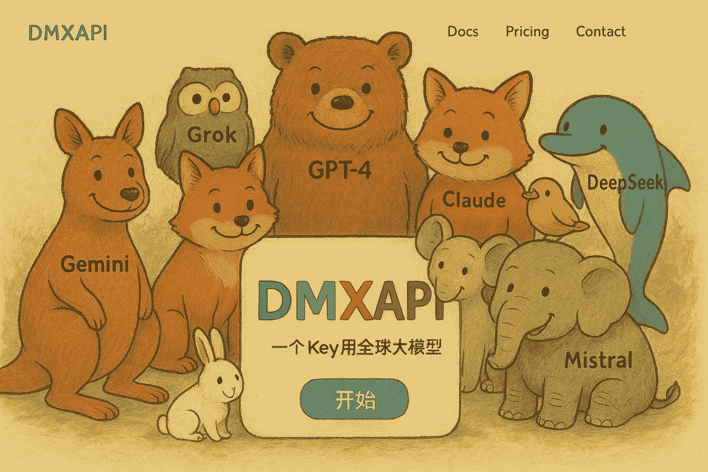

<div align="center">
  <picture>
    <source media="(prefers-color-scheme: dark)" srcset="assets/headerDark.svg" />
    
  </picture>

**B**ilibili **I**ntelligent **L**ive-**I**n **V**elocity **E**ngine

*7 x 24 小时无人监守录制、渲染弹幕、识别字幕、自动切片、自动上传、兼容超低配机器，启动项目，人人都是录播员。*

[:page_facing_up: English Documentation](https://timerring.github.io/bilive/) |
[:gear: Installation](#quick-start) |
[:thinking: Reporting Issues](https://github.com/timerring/bilive/issues/new/choose) |
[:speech_balloon: Chat](https://github.com/timerring/bilive/blob/main/assets/wechat.png)

<div>
  
  

  **大模型API(<a href="https://www.dmxapi.cn/register?aff=vRzR" target="_blank">DMXAPI</a>)** 行业领先的 api 聚合平台 **[详细介绍](#特别感谢)**

<details open>
  <summary> DMX = 大模型拼音首字母 </summary>
  
  <ul>
    <li><a href="https://www.dmxapi.cn/register?aff=vRzR">DMXAPI.cn</a> 一个key用全球大模型</li>
    <li>GPT  Claude  Gemini  6.8折起</li>
    <li><a href="https://ssvip.DMXAPI.com">ssvip.DMXAPI.com</a> 提供生产级稳定服务</li>
  </ul>

</details>

</div>

支持模型

<div>
  
  
  
  
  
</div>

  
  
  
  
  
  
  
  
  
  
  
  
  
</div>

##  1. Introduction

> Have you noticed that *Live-In* is a wordplay :)
>
> 如果您觉得项目不错，欢迎 :star: 也欢迎 PR 合作，如果有任何疑问，欢迎提 issue 交流。
> 
> **敬告：本项目仅供学习交流使用，请在征得对方许可的情况下录制，请勿未经授权私自将内容用于商业用途，请勿用于大规模录制，违者会被官方封禁，法律后果自负。**

自动监听并录制B站直播和弹幕（含付费留言、礼物等），根据分辨率转换弹幕、语音识别字幕并渲染进视频，根据弹幕密度切分精彩片段并通过视频理解大模型生成有趣的标题，根据图像生成模型自动生成视频封面，自动投稿视频和切片至B站，兼容无GPU版本，兼容 x64 及 arm64 超低配置服务器与主机。

## 2. Major features

- **速度快**：采用 `pipeline` 流水线处理视频，理想情况下录播与直播相差半小时以内，没下播就能上线录播，**已知 b 站录播最快的稳定版本**！
- **( 🎉 NEW)多架构**：适配 amd64 及 arm64 架构！
- **多房间**：同时录制多个直播间内容视频以及弹幕文件（包含普通弹幕，付费弹幕以及礼物上舰等信息）。
- **占用小**：自动删除本地已上传的视频，极致节省空间。
- **模版化**：无需复杂配置，开箱即用，通过 b 站搜索建议接口自动抓取相关热门标签。
- **检测片段并合并**：对于网络问题或者直播连线导致的视频流分段，能够自动检测合并成为完整视频。
- **自动渲染弹幕**：自动转换xml为ass弹幕文件，该转换工具库已经开源 [DanmakuConvert](https://github.com/timerring/DanmakuConvert) 并且渲染到视频中形成**有弹幕版视频**并自动上传。
- **硬件要求极低**：无需GPU，只需最基础的单核CPU搭配最低的运存即可完成录制，弹幕渲染，上传等等全部过程，无最低配置要求，10年前的电脑或服务器依然可以使用！
- **( :tada: NEW)自动渲染字幕**：采用 OpenAI 的开源模型 `whisper`，自动识别视频内语音并转换为字幕渲染至视频中。
- **( :tada: NEW)自动切片上传**：根据弹幕密度计算寻找高能片段并切片，该自动切片工具库已开源 [auto-slice-video](https://github.com/timerring/auto-slice-video)，结合多模态视频理解大模型自动生成有意思的切片标题及内容，并且自动上传，目前已经支持的模型有：
  - `GLM-4V-PLUS`
  - `Gemini-2.5-flash`
  - `Qwen-2.5-72B-Instruct`
  - `SenseNova V6 Pro`
- **( :tada: NEW)持久化登录/下载/上传视频(支持多p投稿)**：[bilitool](https://github.com/timerring/bilitool) 已经开源，实现持久化登录，下载视频及弹幕(含多p)/上传视频(可分p投稿)，查询投稿状态，查询详细信息等功能，一键pip安装，可以使用命令行 cli 操作，也可以作为api调用。
- **( :tada: NEW)自动多平台循环直播推流**：该工具已经开源 [looplive](https://github.com/timerring/looplive) 是一个 7 x 24 小时全自动**循环多平台同时推流**直播工具。
- **( :tada: NEW)自动生成风格变换的视频封面**：采用图生图多模态模型，自动获取视频截图并上传风格变换后的视频封面。
  - `Minimax image-01`
  - `Kwai Kolors`
  - `Tencent Hunyuan`
  - `Baidu ERNIE irag-1.0`
  - `Stable Diffusion 3.5 large turbo`
  - `Luma Photon`
  - `Ideogram V_2`
  - `Recraft`
  - `Amazon Titan Image Generator V2`
  - `Hidream I1`
  - `kling-v1-5`


项目架构流程如下：


## 3. 测试硬件

| Machine | Alicloud | Oracle Cloud | local server |
|--------|---------|---------|---------|
| OS | Ubuntu 22.04.4 LTS | debian 6.1.0 | Ubuntu 22.04.4 LTS |
| Architecture | x64 | aarch64 | x64 |
| CPU | 2-core Intel(R) Xeon(R) Platinum 85 | 1-core Neoverse-N1 | 8-core Intel(R) Core(TM) i5-9300H CPU |
| GPU | None | None | Nvidia GeForce GTX 1650 |
| Memory | 2G | 4G | 24G |
| Disk | 40G | 30G | 100G |
| Bandwidth | 3Mbps | 100Mbps | 50Mbps |
| Python Version | 3.10 | 3.10 | 3.10 |

> 个人经验：若想尽可能快地更新视频，主要取决于上传速度而非渲染速度，因此建议网络带宽越大越好。由于 [aarch64 版本 PyPI 没有 release](https://github.com/triton-lang/triton/issues/5561) 的 [triton 库](https://pypi.org/project/triton/#history)，因此 aarch64 版本暂时不支持本地部署 whisper，pip 时请自行注释 requirement 中的 triton 环境，配置均测试可用。

## 4. Quick start

更详细的教程请参考文档 [bilive](https://timerring.github.io/bilive/)

> [!NOTE]
> 如果你是 windows 用户，请使用 WSL 运行本项目。

### Mode
首先介绍本项目三种不同的处理模式：(以下特指 asr_method="deploy" 的情况，如填"none"或者"api"则不涉及 GPU, 可以忽略对 GPU 的描述)
1. `pipeline` 模式(默认): 目前最快的模式，需要 GPU 支持，最好在 `blrec` 设置片段为半小时以内，asr 识别和渲染并行执行，分 p 上传视频片段。

2. `append` 模式: 基本同上，但 asr 识别与渲染过程串行执行，比 pipeline 慢预计 25% 左右，对 GPU 显存要求较低，兼顾硬件性能与处理上传效率。

3. `merge` 模式: 等待所有录制完成，再进行识别渲染合并过程，上传均为完整版录播（非分 P 投稿），等待时间较长，效率较慢，适合需要上传完整录播的场景。


> [!IMPORTANT]
> 凡是用到 GPU 均需保证 GPU 显存大于运行程序所需 VRAM，具体计算 VRAM 方法可以参考[该部分](https://timerring.github.io/bilive/models.html#calculate-vram-requirements)。

### Installation

> [!TIP]
> 如果你是 windows 用户，请使用 WSL 运行本项目。

#### 0. clone 项目

由于项目引入了我写的 submodule [DanmakuConvert](https://github.com/timerring/DanmakuConvert)，[bilitool](https://github.com/timerring/bilitool) 和 [auto-slice-video](https://github.com/timerring/auto-slice-video)，因此推荐 clone 项目时就更新 submodules。

```bash
git clone --recurse-submodules https://github.com/timerring/bilive.git
```

如果你没有采用上述方式 clone 项目，请更新 submodules：

```bash
git submodule update --init --recursive
```

#### 1. 安装依赖(推荐创建虚拟环境)

```
cd bilive
pip install -r requirements.txt
```

此外请根据各自的系统类型安装对应的 [`ffmpeg`](https://www.ffmpeg.org/download.html)，例如 [ubuntu 安装 ffmpeg](https://gcore.com/learning/how-to-install-ffmpeg-on-ubuntu/)。

[常见问题收集](https://timerring.github.io/bilive/install-questions.html)

#### 2. 配置参数

##### 2.1 whisper 语音识别（渲染字幕功能）

> [!TIP]
> - 有关语音识别的配置在 `bilive.toml` 文件的 `[asr]` 部分。
> - `asr_method` 默认为 none, 即不进行语音字幕识别。

##### 2.1.1 采用 api 方式

将 `bilive.toml` 文件中的 `asr_method` 参数设置为 `api`，然后填写 `WHISPER_API_KEY` 参数为你的 [API Key](https://console.groq.com/keys)。

本项目采用 groq 提供 free tier 的 `whisper-large-v3-turbo` 模型，上传限制为 40 MB（约半小时），因此如需采用 api 识别的方式，请将视频录制分段调整为 30 分钟（默认即 30 分钟）。此外，free tier 请求限制为 7200秒/20次/小时，28800秒/2000次/天。如果有更多需求，也欢迎升级到 dev tier，更多信息见[groq 官网](https://console.groq.com/docs/rate-limits)。

##### 2.1.2 采用本地部署方式(需保证有 NVIDIA 显卡)

将 `bilive.toml` 文件中的 `asr_method` 参数设置为 `deploy`，然后下载所需模型文件，并放置在 `src/subtitle/models` 文件夹中。

项目默认采用 [`small`](https://openaipublic.azureedge.net/main/whisper/models/9ecf779972d90ba49c06d968637d720dd632c55bbf19d441fb42bf17a411e794/small.pt) 模型，请点击下载所需文件，并放置在 `src/subtitle/models` 文件夹中。

> [!TIP]
> + 请保证 NVIDIA 显卡驱动安装正确 `nvidia-smi` `nvcc -V`，并能够调用 CUDA 核心 `print(torch.cuda.is_available())` 返回 `True`。如果未配置显卡驱动或未安装 `CUDA`，即使有 GPU 也无法使用，而会使用 CPU 推理，非常消耗 CPU 计算资源，不推荐，如果 CPU 硬件条件好可以尝试。
> + 使用该参数模型至少需要保证有显存大于 2.7GB 的 GPU，否则请使用其他参数量的模型。
> + 更多模型请参考 [whisper 参数模型](https://timerring.github.io/bilive/models.html) 部分。
> + 更换模型方法请参考 [更换模型方法](https://timerring.github.io/bilive/models.html#change-model-method) 部分。

##### 2.2 MLLM 模型（自动切片功能）

> [!TIP]
> - 有关自动切片的配置在 `bilive.toml` 文件的 `[slice]` 部分。
> - `auto_slice` 默认为 false, 即不进行自动切片。
> - 可以通过单元测试调试你自己的 prompt，单元测试在 `tests/test_autoslice.py`，执行 `python -m unittest` 即可，后接 `tests.test_autoslice` 测试整个模块，`tests.test_autoslice.TestXXXMain` 测试某个模型。部分模型会返回多个标题及 emoji，请在 prompt 中指出，仅返回一个标题的字符串即可，推荐先自行调试确保您的 prompt works，欢迎在 issue 中分享你的 prompt。

MLLM 模型主要用于自动切片后的切片标题生成，此功能默认关闭，如果需要打开请将 `auto_slice` 参数设置为 `true`，并且写下你自己的 `slice_prompt`(可以包含 `{artist}` 关键词会自动替换)，其他配置分别有：
- `slice_duration` 以秒为单位设置切片时长（不建议超过 180 秒）。
- `slice_num` 设置切片数量。
- `slice_overlap` 设置切片重叠时长。切片采用滑动窗口法处理，细节内容请见 [auto-slice-video](https://github.com/timerring/auto-slice-video)
- `slice_step` 设置切片步长。
- `min_video_size` 设置最小被切片视频大小，防止对一些连线或者网络波动原因造成的短片段再切片。

接下来配置模型有关的 `mllm_model` 参数即对应的 api-key，请自行根据链接注册账号并且申请对应 api key，填写在对应的参数中，请注意以下模型只有你在 `mllm_model` 参数中设置的那个模型会生效。

| Company   |    Alicloud           |       zhipu        |    Google        | SenseNova |
|----------------|-----------------------|------------------|-------------------|-------------------|
| Name   | Qwen-2.5-72B-Instruct | GLM-4V-PLUS | Gemini-2.0-flash | SenseNova V6 Pro |
| `mllm_model`   | `qwen`  | `zhipu` | `gemini` | `sensenova` |
| `API key`   | [qwen_api_key](https://bailian.console.aliyun.com/?apiKey=1) | [zhipu_api_key](https://www.bigmodel.cn/invite?icode=shBtZUfNE6FfdMH1R6NybGczbXFgPRGIalpycrEwJ28%3D) | [gemini_api_key](https://aistudio.google.com/app/apikey) | [sensenova_api_key](https://console.sensecore.cn/aistudio/management/api-key) |


#### 2.3 Image Generation Model（自动生成视频封面）

> [!TIP]
> - 有关自动生成视频封面的配置在 `bilive.toml` 文件的 `[cover]` 部分。
> - `generate_cover` 默认为 false, 即不进行自动生成视频封面。
> - 可以通过单元测试调试你自己的 prompt，单元测试在 `tests/test_cover.py`，执行 `python -m unittest` 即可，后接 `tests.test_cover` 测试整个模块，`tests.test_cover.TestXXXMain` 测试某个模型。

采用图生图多模态模型，自动获取视频截图并上传风格变换后的视频封面，如需使用本功能，请将 `generate_cover` 参数设置为 `true`，并且写下你自己的 prompt，注意部分模型只支持英文，接下来需要配置的参数有 image_gen_model 和对应的 api key，请自行根据链接注册账号并且申请对应 api key，填写在对应的参数中，请注意以下模型只有你在 `image_gen_model` 参数中设置的那个模型会生效。

推荐使用大模型API([dmxapi.cn](https://www.dmxapi.cn/register?aff=vRzR))，一个 Key 用全球大模型，[查看详细介绍](#特别感谢)。

| Company     | Model Name                        | `image_gen_model`   | `API Key`                                                                  |
|--------------|--------------------------------|-------------------|---------------------------------------------------------------------------------|
| Kwai      | v1-5                       | `kling`         | [dmx_api_token](https://www.dmxapi.cn/token)                                  |

<details>
<summary>其他支持的图像生成模型</summary>

| Company     | Model Name                        | `image_gen_model`   | `API Key`                                                                  |
|--------------|--------------------------------|-------------------|---------------------------------------------------------------------------------|
| Minimax      | image-01                       | `minimax`         | minimax_api_key                                  |
| Kwai  | Kolors                    | `siliconflow`       | siliconflow_api_key                  |
| Tencent      | Hunyuan                | `tencent`           | tencent_secret_id and tencent_secret_key                  |
| Baidu        | ERNIE irag-1.0                   | `baidu`             | baidu_api_key                    |
| Stability AI | Stable Diffusion 3.5 large turbo   | `stability`         | stability_api_key                |
| Luma Labs    | Photon                    | `luma`              | luma_api_key                               |
| Ideogram     | Ideogram V_2                   | `ideogram`          | ideogram_api_key                             |
| Recraft      | Recraft V3                       | `recraft`           | recraft_api_key                          |
| Amazon       | Titan Image Generator V2                        | `amazon`            | aws_access_key_id and aws_secret_access_key                      |
| Hidream      | Hidream I1                       | `hidream`            | hidream_api_key                              |

</details>

#### 3. 配置上传参数

在 `bilive.toml` 中自定义相关配置，映射关键词为 `{artist}`、`{date}`、`{title}`、`{source_link}`，请自行组合删减定制模板：

- `title` 标题模板。
- `description` 简介模板。
- `tid` 视频分区，请参考 [bilitool tid](https://bilitool.timerring.com/tid.html) 文档。
- `gift_price_filter = 1` 表示过滤价格低于 1 元的礼物。
- `reserve_for_fixing = false` 表示如果视频出现错误，重试失败后不保留视频用于修复，推荐硬盘空间有限的用户设置 false。
- `upload_line = "auto"` 表示自动探测上传线路并上传，如果需要指定固定的线路，可以设置为 `bldsa`、`ws`、`tx`、`qn`、`bda2`。

#### 4. 配置录制参数

> [!IMPORTANT]
> 请不要修改任何有关路径的任何配置，否则会导致上传模块不可用

> 录制模块采用第三方 package `blrec`，参数配置在 `settings.toml` 文件，也可以直接在录制启动后在对应的端口可视化页面配置。Quick start 只介绍关键配置，其他配置可自行在页面中对照配置项理解，支持热修改。

- 房间的添加按照文件中 `[[tasks]]` 对应的格式即可。
- 录制模块不登录状态下默认的录制质量为超清。如果需要登录，请将 cookie.json 文件（获取方式见步骤 5）中的 `SESSDATA` 参数值填写到 `[header]` 的 cookie 部分，形式`cookie = "SESSDATA=XXXXXXXXXXX"`，登录后即可录制更高质量画质。(推荐不登录)
- `duration_limit` 表示录制时长，如果采用 whisper api 识别语音，请将分段控制在 1800 秒以内，其他情况没有限制。

#### 5. bilitool 登录（持久化登录，该步只需执行一次）

> 对于 docker 部署，可以忽略这一步，因为 `docker logs` 在控制台中可以打印出二维码，直接扫码即可登录，以下内容针对源码部署。

##### 5.1 方式一 通过 cookie 登录
一般日志文件打印不出二维码效果，所以这步需要提前在机器上安装 [bilitool](https://github.com/timerring/bilitool):

```
pip install bilitool
bilitool login --export
# 然后使用 app 端扫码登录，会自动导出 cookie.json 文件
```
将登录的 cookie.json 文件留在本项目根目录下，`./upload.sh` 启动后即可删除该文件。

##### 5.2 方式二 通过 submodule 登录

或者在 submodule 中登录也可以，方式如下：

```
cd src/upload/bilitool
python -m bilitool.cli login
# 然后使用 app 端扫码即可登录
```

[常见问题收集](https://timerring.github.io/bilive/biliup.html)

#### 6. 启动自动录制

> [!IMPORTANT]
> 在有公网 ip 的服务器上使用默认密码并暴露端口号有潜在的暴露 cookie 风险，因此**不推荐**在有公网 ip 的服务器映射端口号。
> - 如需使用 https，可以考虑 openssl 自签名证书并在 `record.sh` 中添加参数 `--key-file path/to/key-file --cert-file path/to/cert-file`。
> - 可以自行限制服务器端口入站 ip 规则或者采用 nginx 等反向代理配置限制他人访问。

启动前请先设置录制前端页面的密码，并保存在 `RECORD_KEY` 环境变量中, `your_password` 由字母数字组成，最少 8 位，最多 80 位。
- 临时设置密码 `export RECORD_KEY=your_password`。(推荐)
- 持久化设置密码 `echo "export RECORD_KEY=your_password" >> ~/.bashrc && source ~/.bashrc`，其中 `~/.bashrc` 根据你所用的 shell 自行修改即可。

```bash
./record.sh
```

[常见问题收集](https://timerring.github.io/bilive/record.html)

#### 7. 启动自动上传

> 如果你使用 deploy 的方式本地部署 whisper，请先确保你已经正确下载并放置了对应的模型文件，并确保 CUDA 可用。

```bash
./upload.sh
```

[常见问题收集](https://timerring.github.io/bilive/upload.html)

#### 日志信息

相应的执行日志请在 `logs` 文件夹中查看，如果有问题欢迎在 [`issue`](https://github.com/timerring/bilive/issues/new/choose) 中提出，有异常请优先提供 [debug] 级别的日志。

```
logs # 日志文件夹
├── record # blrec 录制日志
│   └── ...
├── scan # scan 处理日志 [debug]级别
│   └── ...
├── upload # upload 上传日志 [debug]级别
│   └── ...
└── runtime # 每次执行的日志 [info]级别
    └── ...
```

### Docker 运行

Docker 版本的配置参考同上，登录方式更加简洁，启动后直接 `docker logs bilive_docker` 在日志中会打印登录二维码，扫码登录即可。

#### 无 GPU 版本

已构建 amd64 及 arm64 版本，会自动根据架构选择。

`your_record_password` 为录制页面的密码，请自行设置，最短 8 最长 80。

```bash
docker run -itd \
    -v your/path/to/bilive.toml:/app/bilive.toml \
    -v your/path/to/settings.toml:/app/settings.toml \
    -v your/path/to/Videos:/app/Videos \
    -v your/path/to/logs:/app/logs \
    --name bilive_docker \
    -e RECORD_KEY=your_record_password \
    -p 22333:2233 \
    ghcr.io/timerring/bilive:0.3.1
```

#### 有 GPU 版本

> [!TIP]
> 使用前请确保你有足够的使用前置知识，如果不熟悉在 docker 中使用 GPU，可以参考 [Docker With GPU](https://blog.timerring.com/posts/docker-with-gpu/)。

有 GPU 版本仅支持 amd64 架构，已内置 small 参数量的模型，如需使用其他参数量模型，请自行按照 2.1.2 步骤调整。`your_record_password` 规则同上。

```bash
sudo docker run -itd \
    -v your/path/to/bilive.toml:/app/bilive.toml \
    -v your/path/to/settings.toml:/app/settings.toml \
    -v your/path/to/Videos:/app/Videos \
    -v your/path/to/logs:/app/logs \
    --gpus 'all,"capabilities=compute,utility,video"' \
    --name bilive_docker_gpu \
    -e RECORD_KEY=your_record_password \
    -p 22333:2233 \
    ghcr.io/timerring/bilive-gpu:0.3.1
```

### Docker Compose

`compose.yml` 调整方法见 [Installation](https://bilive.timerring.com/installation.html)。

#### 使用镜像

如需使用 GPU 版本，请自行在 `compose.yml` 中调整。

```bash
docker compose up -d
```

#### 自行构建

请先在 `compose.yml` 中调整相关配置，然后执行以下命令：

```bash
docker build
docker compose up -d
```

## 特别感谢

- [大模型API](https://www.dmxapi.cn/register?aff=vRzR)([DMXAPI.cn](https://www.dmxapi.cn/register?aff=vRzR))，**DMX 取自“大模型”的拼音首字母，行业领先的智能API聚合服务平台**，旨在帮助 LLM 应用开发的初学者轻松接入多种大模型，快速进入 AI 应用的广阔领域。
  1. **人民币计价全球人工智能大模型API**，[聚合中国和全球**300+多模态大模型**](https://www.dmxapi.cn/pricing)，直连畅通使用国内外领先大模型 API 服务，1个Key使用全模型，涵盖各个领域模型，应有尽有。
  2. **RPM / TPM 无上限**，注册就是顶级账号，不设 RPM / TPM 限制，企业客户集群服务器，支持无限并发。
  3. **合规发票 充值即开**，企业客户支持公对公付款，开具正规发票。
  4. **海外模型低至 7 折，模型原厂集采直供**，通过直接与大模型原厂合作，我们采用集中采购的方式获取资源，确保为您提供极具竞争力的价格，**以更低的成本获取顶级的大模型服务**。
  5. **坚守诚信与专业**，确保向客户提供真实、可靠的模型服务，维护客户的信任与满意度，[服务与承诺](https://dmxapi.cn/chengnuo.html)。
- [acgnhiki/blrec](https://github.com/acgnhiki/blrec)
- [OpenAI/whisper](https://github.com/OpenAI/whisper)
- [biliup/biliup-rs](https://github.com/biliup/biliup-rs)
- [hihkm/DanmakuFactory](https://github.com/hihkm/DanmakuFactory)
