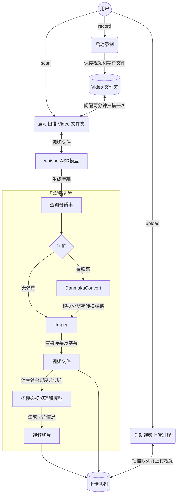

# Introduction

自动监听并录制B站直播和弹幕（含付费留言、礼物等），根据分辨率转换弹幕、语音识别字幕并渲染进视频，根据弹幕密度切分精彩片段并通过视频理解大模型生成有趣的标题，自动投稿视频和切片至B站，兼容无GPU版本，兼容超低配置服务器与主机。

## Major features

- **速度快**：采用 `pipeline` 流水线处理视频，理想情况下录播与直播相差半小时以内，没下播就能上线录播，**目前已知 b 站录播最快版本**！
- **多房间**：同时录制多个直播间内容视频以及弹幕文件（包含普通弹幕，付费弹幕以及礼物上舰等信息）。
- **占用小**：自动删除本地已上传的视频，极致节省空间。
- **模版化**：无需复杂配置，开箱即用，( :tada: NEW)通过 b 站搜索建议接口自动抓取相关热门标签。
- **检测片段并合并**：对于网络问题或者直播连线导致的视频流分段，能够自动检测合并成为完整视频。
- **自动渲染弹幕**：自动转换xml为ass弹幕文件并且渲染到视频中形成**有弹幕版视频**并自动上传。
- **硬件要求极低**：无需GPU，只需最基础的单核CPU搭配最低的运存即可完成录制，弹幕渲染，上传等等全部过程，无最低配置要求，10年前的电脑或服务器依然可以使用！
- **( :tada: NEW)自动渲染字幕**(如需使用本功能，则需保证有 Nvidia 显卡)：采用 OpenAI 的开源模型 [`whisper`](https://github.com/openai/whisper)，自动识别视频内语音并转换为字幕渲染至视频中。
- **( :tada: NEW)自动切片上传**：根据弹幕密度计算寻找高能片段并切片，结合多模态视频理解大模型 [`GLM-4V-PLUS`](https://bigmodel.cn/dev/api/normal-model/glm-4) 自动生成有意思的切片标题及内容，并且自动上传。

## Architecture diagram

项目架构流程如下：

